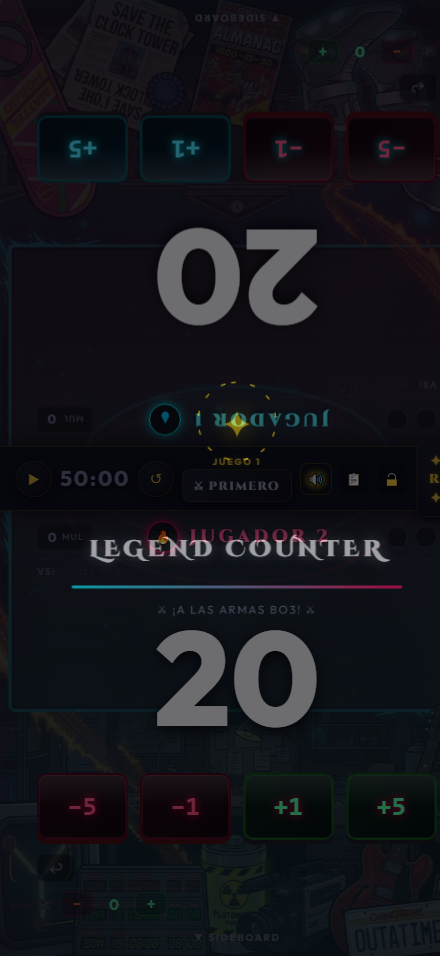

# 🔮 Magic: The Gathering - Premium Multiverse Life Counter (PWA)

Un contador de vidas interactivo y premium para partidas de **Magic: The Gathering (formato BO3 / Commander)**, diseñado como una aplicación web progresiva (PWA) con un alto nivel de detalle visual, efectos de sonido inmersivos, y una integración inteligente de IA para diálogos interactivos entre jugadores.



---

## ✨ Características Principales

*   **🎮 Soporte Multimodo:** Configuración instantánea para partidas de Commander (40 vidas) y juego competitivo BO3 (20 vidas).
*   **🎨 Temas Inmersivos del Multiverso:** Cada tema rediseña por completo la interfaz, los sonidos y la tipografía:
    *   **🌌 Nebula (Estándar):** Fondo galáctico con WebGL en 3D interactivo y efectos de partículas dinámicas.
    *   **🕹️ Street Fighter II:** Aspecto de recreativa clásica de 16 bits con botones arcade cóncavos, efectos de vibración mecánica y de sonido originales.
    *   **🌀 Rick y Morty:** Panel científico verde de garaje, portales interdimensionales y diálogos del show.
    *   **🍩 Los Simpsons:** Tablero de la central nuclear de Springfield con botones de alarma y estilo cómic de dibujo animado.
    *   **🚗 Regreso al Futuro:** Consola analógica inspirada en los circuitos temporales del DeLorean con condensador de fluzo.
    *   **⚔️ Bleach:** Temática de Shinigami con presión espiritual oscura (Reiatsu) y katana envuelta.
*   **💬 Bocadillos de Diálogo Inteligentes (Híbridos):**
    *   **Modo Offline:** Los jugadores gritan ataques y frases típicas de cada tema ante cambios de vida (¡Hadouken!, ¡Gran Scott!, ¡D'oh!, etc.).
    *   **Modo Online (Gemini IA):** Con una clave API de Google Gemini configurada, la IA genera reacciones en tiempo real adaptadas a la situación de vidas y la personalidad del tema (Ryu/Ken vs Bison/Vega, Rick vs Morty, etc.).
*   **🔊 Audio Dual:** Reproduce archivos de audio MP3 de alta fidelidad específicos de cada tema, respaldados por sintetizadores interactivos de baja latencia mediante la **Web Audio API** (Chiptune, Sci-fi, etc.) para jugar offline.
*   **📱 Diseño PWA y Adaptable:** Instalable en dispositivos iOS/Android como una app nativa, con soporte offline mediante Service Workers y optimización táctil.

---

## 🛠️ Instalación y Desarrollo Local

### Requisitos Previos
*   [Node.js](https://nodejs.org/) instalado.

### Clonar y Servir Localmente
1.  Clona este repositorio:
    ```bash
    git clone https://github.com/tu-usuario/mtg-life-counter.git
    cd mtg-life-counter
    ```
2.  Inicia el servidor de desarrollo local:
    ```bash
    node scratch/server.js
    ```
3.  Abre en tu navegador `http://localhost:8080`.

---

## 🛡️ Buenas Prácticas de Ciberseguridad

Este proyecto ha sido desarrollado siguiendo estrictas directrices de seguridad para garantizar un código limpio y seguro al publicarlo en GitHub:

1.  **Cero Exposición de Credenciales:** La API Key de Google Gemini nunca se guarda directamente en el archivo del código fuente. Se captura a través de la interfaz y se almacena localmente en la memoria del navegador del usuario (`localStorage`).
2.  **Prevención de Vulnerabilidades XSS:** Todas las frases inyectadas de manera dinámica en los bocadillos de diálogo usan la propiedad `textContent` del navegador. Esto evita la inyección accidental o maliciosa de scripts JS y HTML en el DOM de la aplicación.
3.  **Aislamiento de Dependencias de Desarrollo:** Los scripts locales de Node (descarga de recursos, servidores locales y empaquetadores) y archivos temporales están excluidos del seguimiento del repositorio mediante un archivo `.gitignore` configurado.
